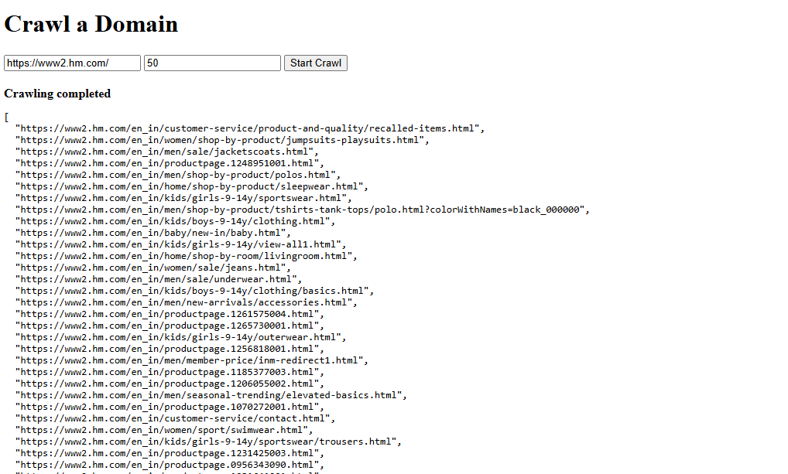

# Web Crawler Project

A Django-based web crawler that scans websites to identify and categorize product pages. The project uses Celery for asynchronous task processing and Redis as a message broker.

## Features

- Domain crawling with configurable depth
- Product page detection with intelligent URL pattern matching
- Support for various e-commerce sites including Myntra, H&M, and others
- Content compression handling including Brotli support
- Asynchronous processing with Celery

## Screenshot



## Prerequisites

- Python 3.8+
- Redis server
- Django 3.2+
- Celery 5.0+

## Installation

### 1. Clone the repository

```bash
git clone https://github.com/Sambhava2410/domain_crawl.git
cd web-crawler
```

### 2. Create a virtual environment

```bash
python -m venv venv
```

Activate the virtual environment:

- Windows:
```bash
venv\Scripts\activate
```

- Linux/Mac:
```bash
source venv/bin/activate
```

### 3. Install requirements

```bash
pip install -r requirements.txt
```

Make sure `requirements.txt` includes the following dependencies:

```
aiohappyeyeballs==2.6.1
aiohttp==3.11.16      
aiosignal==1.3.2      
amqp==5.3.1
asgiref==3.8.1        
asyncio==3.4.3        
attrs==25.3.0
beautifulsoup4==4.13.3
billiard==4.2.1       
Brotli==1.1.0
celery==5.5.0
certifi==2025.1.31
charset-normalizer==3.4.1
click==8.1.8
click-didyoumean==0.3.1
click-plugins==1.1.1
click-repl==0.3.0
colorama==0.4.6
Django==5.2
django-celery-results==2.5.1
docker==7.1.0
frozenlist==1.5.0
greenlet==3.1.1
idna==3.10
kombu==5.5.2
lxml==5.3.1
multidict==6.3.2
playwright==1.51.0
prompt_toolkit==3.0.50
propcache==0.3.1
pyee==12.1.1
python-dateutil==2.9.0.post0
python-dotenv==1.1.0
pywin32==310
redis==5.2.1
requests==2.32.3
six==1.17.0
soupsieve==2.6
sqlparse==0.5.3
tqdm==4.67.1
typing_extensions==4.13.1
tzdata==2025.2
urllib3==2.3.0
vine==5.1.0
wcwidth==0.2.13
yarl==1.18.3
```

### 4. Install Brotli

The crawler requires Brotli for handling compressed content:

```bash
pip install brotli
```

### 5. Create Django project and app

If you're starting from scratch:

```bash
django-admin startproject crawler_project .
cd crawler_project
python manage.py startapp crawler
```

### 6. Configure settings

Update `settings.py` with Celery and Redis configuration:

```python
# Celery Configuration
CELERY_BROKER_URL = 'redis://localhost:6379/0'
CELERY_RESULT_BACKEND = 'redis://localhost:6379/0'
CELERY_ACCEPT_CONTENT = ['json']
CELERY_TASK_SERIALIZER = 'json'
CELERY_RESULT_SERIALIZER = 'json'
```

### 7. Set up Redis

#### Windows Users

For Windows users, it's recommended to use WSL (Windows Subsystem for Linux) to run Redis:

1. Install WSL if you haven't already:
```bash
wsl --install
```

2. Launch Ubuntu terminal through WSL

3. Install Redis in Ubuntu:
```bash
sudo apt update
sudo apt install redis-server
```

4. Start Redis server:
```bash
sudo service redis-server start
```

5. Verify Redis is running:
```bash
redis-cli ping
```
It should respond with "PONG"

#### Linux/Mac Users

```bash
sudo apt update
sudo apt install redis-server
sudo systemctl start redis
```

### 8. Run migrations

```bash
python manage.py makemigrations
python manage.py migrate
```

## Running the Application

### 1. Start the Django development server

```bash
python manage.py runserver
```

### 2. Start Celery worker

#### Windows users (using WSL Ubuntu terminal)

Open your WSL Ubuntu terminal and navigate to your project directory:

```bash
cd /mnt/c/path/to/your/project
source venv/bin/activate
celery -A crawler_project worker --loglevel=info
```

#### Linux/Mac users

```bash
celery -A crawler_project worker --loglevel=info
```

### 3. Access the web interface

Open your browser and navigate to:
```
http://127.0.0.1:8000/crawler/
```

## Usage

1. Enter the domain URL you want to crawl (e.g., https://www2.hm.com/)
2. Set the crawl depth (e.g., 50)
3. Click "Start Crawl"
4. The system will display the product URLs found during the crawl

## Troubleshooting

### Common Issues

1. **Brotli Decompression Error**
   - Error: `Client error: 400, message='Can not decode content-encoding: brotli (br). Please install Brotli'`
   - Solution: Make sure to install the Brotli library: `pip install brotli`

2. **Redis Connection Error**
   - Error: `Error connecting to redis://localhost:6379/0`
   - Solution: Make sure Redis is running. For Windows users, use WSL Ubuntu terminal to start Redis.

3. **Celery Worker Not Starting**
   - Make sure the correct application name is used in the Celery command
   - Check your project structure and celery configuration files

## Project Structure

```
web-crawler/
├── crawler_project/
│   ├── __init__.py
│   ├── celery.py
│   ├── settings.py
│   ├── urls.py
│   └── wsgi.py
├── crawler/
│   ├── __init__.py
│   ├── models.py
│   ├── tasks.py
│   ├── urls.py
│   ├── views.py
│   └── url_processor.py
├── templates/
│   └── crawler/
│       └── index.html
├── static/
│   └── css/
│       └── styles.css
├── requirements.txt
├── manage.py
└── README.md
```

## Contributing

Contributions are welcome! Please feel free to submit a Pull Request.

## License

This project is licensed under the MIT License - see the LICENSE file for details.